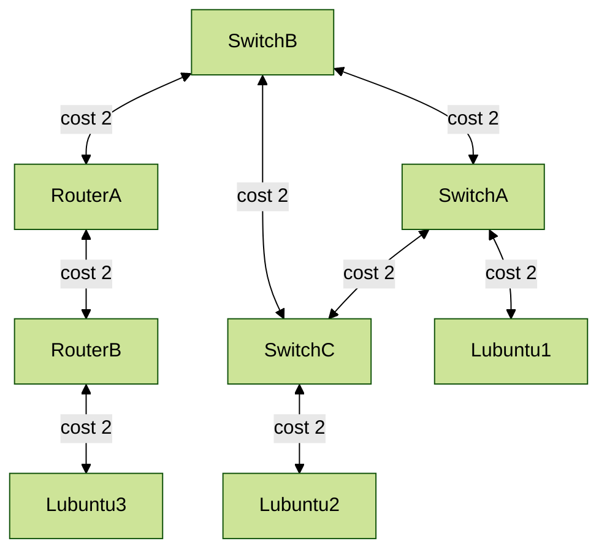

# E07 

The functionality of a switch is to learn about their surroundings. When the switch receive an ethernet frame, and build up their forwarding table - "MAC-address table, -show fdb", they start to forward traffic in an ethernet network. 
If a switch do not have a destination MAC-address, an unknown address that is not in the FDB, the switch will spam out unknown MAC-addresses. "Unknown dstMAC frames" out of all ports. 

Within a RING topology, this is bad if there is no loop-detection, and it will form an infinite repetition loop. **Ethernet frames do not have TTL-field.**

```
Following the thread on this one to elaborate.

Historically it seems that a TTL-field on the ethernet frames were not, thought of or needed when they were introduced due to the limited complexities within networks, before switches and such were invented. 
Why not add it in later on? From what I have gained, a TTL-field would in the end just stop the one frame, and not fix an underlying issue of looping frames. 

From what I understand, if a host is caught in a loop, it is unaccessible from other hosts on the network. A "broadcast storm" can occur when there are so many frames in a loop that all avaliable bandwidth
is consumed. A TTL value would still have the frame run a loop, just not indefinitely, but long enough to cause problems? Can it be compared to a denial of service attack? 
In such a broadcast storm the forwarding tables are constantly updated with MAC-addresses, and even though the packet finally arrives at the correct destination it seems the tables are constantly faulty updated so the answer wont
be sent to the right recipient.

In the end, would not a TTL-field atleast help? But perhabs its still too little help to fix the issue. There will always be loops in a network which have been designed to avoid a single point of failure, 
and have multiple "roads". when this redundancy is introduced, loops and duplicate frames occur.  Despite the questions of TTL, this is the reason why The Spanning Tree Protocol was created, and from what I can see before entering
the materials is that it fixes the issues and TTL is out of the question. 

```

## Plan

- [ ] Update and review current topology
	- [ ] Add Network_Switch_C to the topology, RING-topology
	- [ ] Move Lubuntu2 machine behind Network_Switch_C
	- [ ] Update adapters VirtualBox
	
- [ ] Configuration, update VLAN
	- [ ] Switch A
	- [ ] Switch B
	- [ ] Switch C

- [ ] Loop

- [ ] Spanning Tree Protocol
	- [ ] Update topology schematic
	- [ ] Enable on all 3 Switches
	- [ ] Investigate port states 
	- [ ] Testing
	- [ ] Last phase testing, measure changes in topology
	
# Update and review current topology

First steps is to clone a switch and add it to the schematic, set as a RING with the other switches. Then moving Lubuntu2 behind the new switch. 


## Draft of physical topology changes


## Updating adapters

After drafting the physical changes, I start checking the adapters in VirtualBox, to make sure the "cables and interfaces" are correct. 


- [x] Update and review current topology
	- [x] Add Network_Switch_C to the topology, RING-topology
	- [x] Move Lubuntu2 machine behind Network_Switch_C
	- [x] Update adapters VirtualBox


## Updating VLAN & tagging ports


- [x] Switch A
	


- [x] Switch B
	


In addition to this, adding a new ip-address and a gateway to Switch C.


- [x] Switch C
- [x] Configuration, update VLAN

# Connectivity tests pre-STP

## Switch A and B online, Switch C offline

Powering up all 3 Lubuntus, both routers and the abovementioned Switch A and B. 

Initially I ping Lubuntu3 from Lubuntu1:


Then I ping various devices from Lubuntu3:


Seeing that Network_Switch_C is offline, any response from Lubuntu2 is not going to happend, as Lubuntu2 is only connected to Network_Switch_C.


## Switch B and C online, Switch A offline

Shutting down Switch A, powering up Switch C. 

Lubuntu3 to Lubuntu2:


Lubuntu 2 to different parts of the topology:


# Creating a loop

I start of by closing down all switches, keeping routers and lubuntus online. I then proceed in making the lubuntus ping eachother, each Lubuntu marked with a red square around its number. 


Having all 3 Lubuntus pinging eachother, but no switches being online - none will reach. In the next figure I start Network_Switch_A. 

I proceed starting Network_Switch_A and Network_Switch_B, monitoring the gpu as well as checking port status on the switches once they are online. 

After Switch A is up, there is still no connectivity as the other lubuntus need atleast one of the other switches to be online aswell. 

Booting up Switch B, and connection between Lubuntu3 and Lubuntu1 is visible in the picture below. Lubuntu2 is still behind Switch C. 
For some reason Lubuntu1 is not reaching Lubuntu3, but it does work the other way around. Cancelling the ping and restarting it fixes the problem. 


### Starting Network_Switch_C
Starting up the third Switch, completing the connection of the RING, visualized in the following **GIF**.
Immidiately I see that the processor is hitting the roof. Lubuntu2 Also suddenly get response from Lubuntu3, but it is very slow to update on the screen. 
In addition Lubuntu3 sees a hop in response "latency". 


### Shutting down Network_Switch_C
And finally when shutting down Switch C, the processes drop immidiately, as shown in the **GIF** below. 


# Spanning Tree Protocol 

## Configuring switches

Staring with Network_Switch_B as root, then A as backup root and lastly also adding STP to all VLANS and enabling it on Switch C. I do notice later on that "backup" is not enabled within the configurations 
of the STP on either Switch. However the priority ID is set accordingly, so I suspect maybe there would be some reactions depending on which ports I temporarily disable at the end of this exercise. 

**Switch B:**


**Switch A:**


**Switch C:**


At the end of this, I start up Switch A and B, so all 3 are online. 


As can be seen in the **GIF** below, the Lubuntus are now able to communicate and it seems the looping is under control!


- [ ] Spanning Tree Protocol
	- [ ] Update topology schematic
	- [x] Enable on all 3 Switches
	- [ ] Investigate port states
	- [x] Testing
	- [ ] Last phase testing, measure changes in topology
	
	
	
	
	
**Network_Switch_B**

```	
------------------------
SwitchB.1 # show stpd s0 
------------------------
Stpd: s0                Stp: ENABLED            Number of Ports: 3
Rapid Root Failover: Disabled
Operational Mode: MSTP                  Default Binding Mode: 802.1D
MSTI Instance:  CIST
802.1Q Tag: (none)
Ports: 1,2,3
Participating Vlans: network_devices,secretbasement,workstations
Auto-bind Vlans: Default
Bridge Priority            : 4096               Bridge Priority Mode: 802.1t
Operational Bridge Priority: 4096
BridgeID                   : 10:00:08:00:27:02:cc:fa
Designated root            : 10:00:08:00:27:02:cc:fa
CIST Root                  : 10:00:08:00:27:02:cc:fa
CIST Regional Root         : 10:00:08:00:27:02:cc:fa
External RootPathCost      : 0  Internal RootPathCost: 0 
Root Port   : ----      
MaxAge      : 20s       HelloTime     : 2s      ForwardDelay     : 15s
CfgBrMaxAge : 20s       CfgBrHelloTime: 2s      CfgBrForwardDelay: 15s
RemainHopCount: 20      CfgMaxHopCount: 20
Topology Change Time           : 35s            Hold time        : 1s
Topology Change Detected       : FALSE          Topology Change  : FALSE
Number of Topology Changes     : 2
Time Since Last Topology Change: 725s
Topology Change initiated locally on Port 2
Topology Change last received on Port 1 from 08:00:27:8b:dd:b1
Backup Root               : Off         Backup Root Activated  : FALSE
Loop Protect Event Window : 180s        Loop Protect Threshold : 3
New Root Trap             : On          Topology Change Trap   : Off
Tx Hold Count             : 6
SwitchB.2 # 


------------------------------
SwitchB.2 # show stpd s0 ports 
------------------------------

Port     Mode   State      Cost  Flags     Priority Port ID Designated Bridge
1      802.1D FORWARDING 200000 eDap-m--I- 128      8001    10:00:08:00:27:02:cc:fa
2      802.1D FORWARDING 200000 eDap-m--I- 128      8002    10:00:08:00:27:02:cc:fa
3      802.1D FORWARDING 200000 eDappw--B- 128      8003    10:00:08:00:27:02:cc:fa

Total Ports: 3

 ------------------------- Flags: ----------------------------
1:                e=Enable, d=Disable
2: (Port role)    R=Root, D=Designated, A=Alternate, B=Backup, M=Master
3: (Config type)  b=broadcast, p=point-to-point, e=edge, a=auto
4: (Oper. type)   b=broadcast, p=point-to-point, e=edge
5:                p=proposing, a=agree
6: (partner mode) d = 802.1d, w = 802.1w, m = mstp
7:                i = edgeport inconsistency
8:                S = edgeport safe guard active
                  s = edgeport safe guard configured but inactive
8:                G = edgeport safe guard bpdu restrict active in 802.1w and mstp
                  g = edgeport safe guard bpdu restrict active in 802.1d
9:                B = Boundary, I = Internal
10:               r = restricted role, t = active role
SwitchB.3 # 

```

**Network_Switch_A**

```
Lubuntu-1: ssh admin@10.8.83.1
admin@10.8.83.1's password: 
ExtremeXOS
Copyright (C) 1996-2020 Extreme Networks. All rights reserved.
...
==============================================================================


Press the <tab> or '?' key at any time for completions.
Remember to save your configuration changes.

------------------------
SwitchA.1 # show stpd s0 
------------------------
Stpd: s0                Stp: ENABLED            Number of Ports: 3
Rapid Root Failover: Disabled
Operational Mode: MSTP                  Default Binding Mode: 802.1D
MSTI Instance:  CIST
802.1Q Tag: (none)
Ports: 1,2,3
Participating Vlans: network_devices,secretbasement,workstations
Auto-bind Vlans: Default
Bridge Priority            : 8192               Bridge Priority Mode: 802.1t
Operational Bridge Priority: 8192
BridgeID                   : 20:00:08:00:27:8b:dd:b1
Designated root            : 10:00:08:00:27:02:cc:fa
CIST Root                  : 10:00:08:00:27:02:cc:fa
CIST Regional Root         : 10:00:08:00:27:02:cc:fa
External RootPathCost      : 0  Internal RootPathCost: 200000 
Root Port   : 2         
MaxAge      : 20s       HelloTime     : 2s      ForwardDelay     : 15s
CfgBrMaxAge : 20s       CfgBrHelloTime: 2s      CfgBrForwardDelay: 15s
RemainHopCount: 19      CfgMaxHopCount: 20
Topology Change Time           : 35s            Hold time        : 1s
Topology Change Detected       : FALSE          Topology Change  : FALSE
Number of Topology Changes     : 3
Time Since Last Topology Change: 903s
Topology Change initiated locally on Port 3
Topology Change last received on Port 2 from 08:00:27:02:cc:fa
Backup Root               : Off         Backup Root Activated  : FALSE
Loop Protect Event Window : 180s        Loop Protect Threshold : 3
New Root Trap             : On          Topology Change Trap   : Off
Tx Hold Count             : 6
SwitchA.2 # show stpd s0 ports 
Port     Mode   State      Cost  Flags     Priority Port ID Designated Bridge
1      802.1D FORWARDING 200000 eDappw--B- 128      8001    20:00:08:00:27:8b:dd:b1
2      802.1D FORWARDING 200000 eRapam--I- 128      8002    10:00:08:00:27:02:cc:fa
3      802.1D FORWARDING 200000 eDap-m--I- 128      8003    20:00:08:00:27:8b:dd:b1

Total Ports: 3

 ------------------------- Flags: ----------------------------
1:                e=Enable, d=Disable
2: (Port role)    R=Root, D=Designated, A=Alternate, B=Backup, M=Master
3: (Config type)  b=broadcast, p=point-to-point, e=edge, a=auto
4: (Oper. type)   b=broadcast, p=point-to-point, e=edge
5:                p=proposing, a=agree
6: (partner mode) d = 802.1d, w = 802.1w, m = mstp
7:                i = edgeport inconsistency
8:                S = edgeport safe guard active
                  s = edgeport safe guard configured but inactive
8:                G = edgeport safe guard bpdu restrict active in 802.1w and mstp
                  g = edgeport safe guard bpdu restrict active in 802.1d
9:                B = Boundary, I = Internal
10:               r = restricted role, t = active role
SwitchA.3 # 
```


**Network_Switch_C**

```
------------------------
SwitchC.1 # show stpd s0 
------------------------
Stpd: s0                Stp: ENABLED            Number of Ports: 3
Rapid Root Failover: Disabled
Operational Mode: MSTP                  Default Binding Mode: 802.1D
MSTI Instance:  CIST
802.1Q Tag: (none)
Ports: 1,2,3
Participating Vlans: network_devices,secretbasement,workstations
Auto-bind Vlans: Default
Bridge Priority            : 32768              Bridge Priority Mode: 802.1t
Operational Bridge Priority: 32768
BridgeID                   : 80:00:08:00:27:94:2c:0b
Designated root            : 10:00:08:00:27:02:cc:fa
CIST Root                  : 10:00:08:00:27:02:cc:fa
CIST Regional Root         : 10:00:08:00:27:02:cc:fa
External RootPathCost      : 0  Internal RootPathCost: 200000 
Root Port   : 2         
MaxAge      : 20s       HelloTime     : 2s      ForwardDelay     : 15s
CfgBrMaxAge : 20s       CfgBrHelloTime: 2s      CfgBrForwardDelay: 15s
RemainHopCount: 19      CfgMaxHopCount: 20
Topology Change Time           : 35s            Hold time        : 1s
Topology Change Detected       : FALSE          Topology Change  : FALSE
Number of Topology Changes     : 2
Time Since Last Topology Change: 1029s
Topology Change initiated locally on Port none
Topology Change last received on Port 2 from 08:00:27:02:cc:fa
Backup Root               : Off         Backup Root Activated  : FALSE
Loop Protect Event Window : 180s        Loop Protect Threshold : 3
New Root Trap             : On          Topology Change Trap   : Off
Tx Hold Count             : 6
------------------------
SwitchC.2 # show stpd s0 ports 
------------------------
Port     Mode   State      Cost  Flags     Priority Port ID Designated Bridge
1      802.1D BLOCKING   200000 eAapam--I- 128      8001    20:00:08:00:27:8b:dd:b1
2      802.1D FORWARDING 200000 eRapam--I- 128      8002    10:00:08:00:27:02:cc:fa
3      802.1D FORWARDING 200000 eDap-w--B- 128      8003    80:00:08:00:27:94:2c:0b

Total Ports: 3

 ------------------------- Flags: ----------------------------
1:                e=Enable, d=Disable
2: (Port role)    R=Root, D=Designated, A=Alternate, B=Backup, M=Master
3: (Config type)  b=broadcast, p=point-to-point, e=edge, a=auto
4: (Oper. type)   b=broadcast, p=point-to-point, e=edge
5:                p=proposing, a=agree
6: (partner mode) d = 802.1d, w = 802.1w, m = mstp
7:                i = edgeport inconsistency
8:                S = edgeport safe guard active
                  s = edgeport safe guard configured but inactive
8:                G = edgeport safe guard bpdu restrict active in 802.1w and mstp
                  g = edgeport safe guard bpdu restrict active in 802.1d
9:                B = Boundary, I = Internal
10:               r = restricted role, t = active role
SwitchC.3 # 


```

### STP topology 

From the results above, the STP part of my topology should currently be as shown below: 


```
Is the root switch position ideal? Are the ports forwarding as you would have expected?
```

From the material, the switch with the lowest priority-number (or of 2 with similar priority the one of them with the lowest decimal value MAC-address) would be determined to be the root switch. 
When setting up the STP on each switch, I have already decided that Network_Switch_B would have this role, due to the priority count of 4096. 
This because I feel this is the top/bottom point where all branches reach out towards the other devices. 

This way traffic will go through the root-switch on its way to each part of the system, and would have multiple ways in case of a cable/connection breaking between the other switches. 
From trying to understand more, the term Spanning Tree Cost comes up, or path/port cost. I further see I can get this information from the BPDU-frame. 

Though from looking and thinking of my physical topology, the cables within the network at this point are of the same speed and lenght, hence I believe the cost would be the same.
However, when having more and more network devices in my topology, the path grows longer. If I have a 10Gbit connection between all devices, from what I understand it would have a path or port-cost of 2. 





From the chart the distance from object to **SwitchB as root**:
- Lubuntu1 to SwitchB has a cost of 4 via SwitchA OR 6 via SwitchA then SwitchC
- Lubuntu2 to SwitchB has a cost of 4 via SwitchC OR 6 through SwitchC and A 
- Lubuntu3 to SwitchB has a cost of 6 via RouterB, RouterA then SwitchB

If **SwitchC** was root:
- Lubuntu1 to SwitchC has a cost of 4 via SwitchA OR 6 via SwitchA then SwitchB
- Lubuntu2 to SwitchC has a cost of 2 directly to SwitchC
- Lubuntu3 to SwitchC has a cost of 8 Via RouterB, RouterA, SwitchB then SwitchC

If **SwitchA** was root:
- Lubuntu1 to SwitchA has a cost of 2 directly to SwitchA
- Lubuntu2 to SwitchA has a cost of 4 via SwitchC to SwitchA OR 6 via SwitchC, SwitchB then SwitchA
- Lubuntu3 to SwitchA has a cost of 8 via RouterB, RouterA, SwitchB then SwitchA OR 10 via RouterB, RouterA, SwitchB, SwitchC then SwitchA

All in all, for all three variations the total path cost would be the same. So my conclusion to that part is that of this current setup - it doesnt matter in terms of path cost. 
However for safety and points of failures, the location of which most likely to stay connected to parts of the network seems to be at where Switch B is. 

In terms of the alternative route and location of this, between Switch A and C, that does seem logical. The far points of this part of the network - Lubuntu1 and Lubuntu2 - have shorter roads to Switch B. In case of failure on the ideal routes they have an alternative path. 

As an **end note** on this section, I believe that the cost does not decide the root-switch(I already explained that previously), nor does traffic change due to the cost it self. But - when the switches sends STP information
to eachother and marks each port RP / DP and such, RP would be the port with the lowest cost towards the root switch. However I think it might be a nice way to set up and
compare the different "roads to ro(me)ot". 


- [x] Spanning Tree Protocol
	- [x] Create topology for STP view
	- [x] Enable on all 3 Switches
	- [x] Investigate port states
	- [x] Testing


## Last phase testing, measure changes in topology


I set up the VMs so I can see as much as I can in my limited screenspace. 

- Lubuntu1 is pinging Lubuntu2
- Lubuntu2 is pinging Lubuntu3
- Lubuntu3 is pinging Lubuntu1 

### Disabling port 1
The first **gif** shows me disabling port 1 of the root switch, Network_Switch_B.
Notice the skip of icmp_sequence on Lubuntu1 and Lubuntu3. 


I have highlighted the skip of sequences in the picture below. Port 1 on Switch B is the port that goes towards Switch A. 


|Lubuntu1 to 2|
|----|
|Lubuntu1 gets its path disrupted, as It is bound to prefer travelling from P2 in SwitchA to P1 in SwitchB, but instead needs to take the alternative route from P3 on SwitchA to P3 on SwitchC, and then to Lubuntu2. This is a curious realization, as this is actually the fastest waywith a cost of 6, while through the RP to Root switch it costs 8.|

|Lubuntu2 to 3|
|----|
|Lubuntu2 however remains stable, as it is pinging Lubuntu3 and is entering port2 on SwitchB, before continuing out Port3 towards the path to Lubuntu3.|

|Lubuntu3 to 1|
|----|
|Lubuntu3 gets interupted, as its ping is sent thowards SwitchB, and has its main route through port 1. However with that port being disabled, the ping continues to switch C, before going up to Switch A and then out to Lubuntu1.|

#### Schematic for this scenario


### Disabling port 2


I have highlighted the skip of sequences in the picture below. Port 2 on Switch B is the port that goes towards Switch C. 


|Lubuntu1 to 2|
|----|
|Skips from 1889-1894. Based on the priority of switches, the ping should go from Lubuntu1, to SwitchA, to SwitchB then to SwitchC and out to Lubuntu2. It skips a short while, of which I am thinking it might be due to the switches re-routing the signal back from SwitchB to Switch A again, since the route from SwitchB to SwitchC is disabled. The signal then goes the alternative route between SwitchA and SwitchC.|

|Lubuntu2 to 3|
|----|
|Skips from 1895 to 1900. By following priority the ping goes from SwitchC to SwitchB then up the network to Lubuntu3. When the port between SwitchB and C is disabled, it has to go from Switches C, then A, then B before going towards Lubuntu3. |

|Lubuntu3 to 1|
|----|
|It is not disrupted on its path as by following the priority it will go from SwitchB, directly to SwitchA and out to Lubuntu1. This since the cost of the route via just B and A is the lowest. The connection between C and A is alternative, and also costs more. |

To measure the change when enabling the port again, the following skips can be seen when I enable port 2:


#### Schematic for this scenario


### Disabling port 3

I have highlighted the skip of sequences in the picture below. Port 3 on Switch B is the port that goes towards RouterA.

The result here speak for itself, as we are disabling the connection between SwitchB and RouterA - which again is the gateway for each VLAN to communicate between eachother, and also the route to RouterB and Lubuntu3. 

{width=75%}

{width=75%}


#### Schematic for this scenario


 


