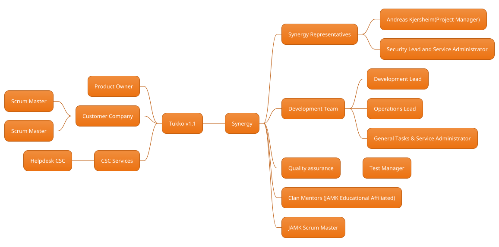
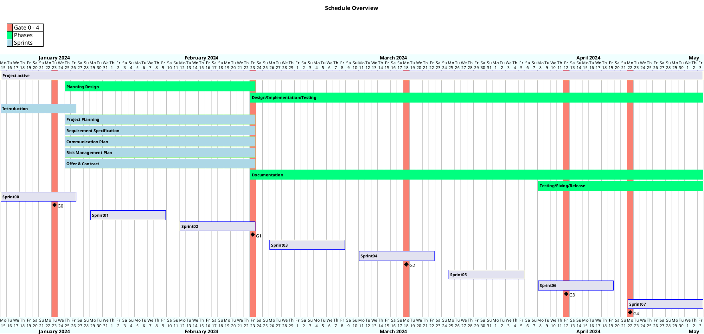

# Project plan - Synergy - Tukko v1.1

|  |  |
|:-:|:-:|
| Document | Project Plan |
| Author: | Andreas Kjersheim |
| Version: | 1.3 |
| Date: | 19.02.2024 |

</img>

## 1 Assignment

### 1.1 Background and Starting Points

*The assignment at hand is part of the OPF framework, specifically within the scope of the TTOS2070 Guideline at the Jyväskylä University of Applied Sciences. The overarching goal of this project is to develop and enhance existing components, known as "objects," as a broader effort within the OPF framework.*

This project lead by the development team named "Synergy". We are consisting of dedicated individuals with diverse roles and skillsets. This interdisciplinary team aims to collaborate effectively to achieve the project's objectives.

Synergy is comprised of the following key roles:
**Removing names for privacy, but keeping the roles to show the team.**

<strong>Team Leader:</strong> Andreas Kjersheim

<strong>Operations Lead:</strong> 

<strong>General, Assisting in Coordination and Administration:</strong>

<strong>Security Lead, Manager Administrations:</strong>

<strong>Tester Lead:</strong>

<strong>Development Lead:</strong>

The project's focal point is the collaboration with the customer, customer . Under the guidance of Scrum Masters from the customer company  initially assigned the project "Tukko" to Team IoTitude in WIMMA Lab 2023. This project marks the continuation of collaboration between the customer company and JAMK University of Applied Sciences, resulting in a new assignment for future Tukko implementations.

The primary goal of the project is to evolve "Tukko," specifically targeting the creation of "Tukko v1.1." Tukko serves as a traffic visualizer web application, built as a framework comprising modules utilizing various technologies including React, MongoDB, TypeScript, Redis, Express.js, Node.js, REST API, and VITE. Its primary function is to streamline and enhance data from the digitraffic API, unifying scattered information into a more user-friendly interface. The tool also collects and stores long-term data for anomaly detection.

Development for Tukko follows industry best practices with a strict adherence to Typescript and ESLint rulesets. Despite being a complete product, there are numerous unexplored ideas due to project time constraints.

The project's methodologies include Agile principles, with Scrum as the chosen framework. Tools such as Gitlab and the OPF-framework serve as the backbone for all project documentation.

The project also encompasses educational elements, ensuring that team members possess the necessary skills and knowledge for their roles, including familiarity with Git, Linux basics, project management concepts, requirements definition, Agile development principles, programming languages like Python and JavaScript, and networking fundamentals.

Furthermore, the project outlines specific milestones and deliverables, with defined criteria for Gate reviews to ensure project progress and quality. This assignment not only involves software development but also emphasizes effective documentation, customer communication, and testing.

To facilitate project management and tracking, the project adheres to a structured sprint-based schedule, divided into 8 sprints from Sprint00 to Sprint07, each lasting 2 weeks. As a student project, the main course have certain phases from Phase0 to Phase3, each with its distinct objectives and tasks. As major Milestones in our schedule, we are using gates throughout our development, ranging from GATE0 to GATE4. The ultimate aim is continuous improvement and the successful development of Tukko v1.1, aligning with the goals of customer Finland's assignment.

Please refer to the subsequent sections for a comprehensive breakdown of the project's details, goals, and timelines.

### 1.2 Goals and Tasks

This section provides an in-depth understanding of the goals and tasks set for the "Synergy - FF2024" project, encompassing its background, objectives, resources, organization, and vision.

### 1.2.1 Background

The project centers around the enhancement and evolution of the existing "Tukko" traffic visualizer web application. This initiative stems from customer Finland's initial assignment in WIMMA Lab 2023, where Team IoTitude developed Tukko v1.0. Building upon this foundation, our team, Synergy, is tasked with creating "Tukko v1.1."

### 1.2.2 Objectives

The primary objective is to create Tukko v1.1, a comprehensive and improved version of the traffic visualizer web application. This new iteration aims to excel in various aspects, including:

<ins>User Interface and Accessibility (Epic 01):</ins> Enhance the user interface for improved accessibility and usability.

<ins>Data Analysis and Export (Epic 02):</ins> Improve data analysis capabilities and data export features.

<ins>Nordic Scalability (Epic 03):</ins> Ensure the application's scalability to cater to a broader Nordic audience.

<ins>Security and Authentication (Epic 04):</ins> Strengthen security measures and user authentication.

<ins>Infrastructure and Performance (Epic 05):</ins> Optimize the infrastructure for superior performance.

The project closely aligns with customer Finland's assignment, and our team will assess our skillset and time constraints to create an offer detailing the features we can incorporate into Tukko v1.1, working towards their vision for future implementations.

### 1.2.3 Tasks

The project's tasks are organized into a series of sprints, each marked with specific GATEs (0-4), that serve as milestones and checkpoints to ensure project progress. While a detailed schedule overview will follow, the key tasks within these sprints encompass:

- **Sprint 00:** Initiating the project, team formation, and providing an introductory overview (GATE 0).

- **Sprint 01:** Developing a comprehensive project plan, designing enhancements for Tukko v1.1, specifying requirements, and preparing an offer for the customer.

- **Sprint 02:** Focusing on planning activities, including Project Planning, Planning Design, Requirement Specification, Offer & Contract, Communication Plan, and Risk Management Plan. While no implementations are done during this sprint, we are focusing on planning out a prototype with select features to accompany our offer (GATE 1).

- **Sprint 03:** Continuing planning and documentation preparation, in preparation for Sprint  04 and the continuing development. This sprint is somewhat affected by general holidays in Finland from 26.02-01.03. 

- **Sprint 04:** Continuation of the execution phase, with a strong emphasis on Design, Implementation, and Testing of planned features. A status check takes place at the midpoint of this sprint (GATE 2).

- **Sprint 05:** Continuing feature implementation and testing.

- **Sprint 06:** Continued focusing on testing, bug fixing, release preparations. The midpoint marks another highlight(GATE 3), known as Demo Day. Initiating project documentation for final delivery.

- **Sprint 07:** The final sprint, preparing for project completion, including the Release(GATE 4). Primarily dedicated to wrapping up any pending tasks and operations. 

The end of Sprint 07 marks the due date for project documentation and associated course modules.

### 1.2.4 Resources and Organization

The project operates with a dedicated team, Synergy, consisting of individuals holding distinct roles and responsibilities. These roles include Team Leader, Operations Lead, General Coordinator, Security Lead, Tester Lead, and Development Lead. The team collaborates efficiently to meet project objectives and deliverables.

In addition to the core team, the project benefits from the oversight from the course Scrum Master, and the Product Owner. PO relays guidance from Scrum Masters the customer company. These Scrum Masters serve as key stakeholders, providing valuable insights and ensuring alignment with the customers needs.

### 1.2.5 Vision of Future State

The project envisions a future state where "Tukko v1.1" stands as an advanced and feature-rich traffic visualizer web application. In this state, Tukko offers enhanced user experiences, improved data analysis capabilities, increased scalability, robust security measures, and optimal infrastructure performance. The application will be well-documented, thoroughly tested, and ready for deployment.

Intermediate results within each sprint and GATE contribute to the realization of this vision, with continuous improvements and milestones guiding the project towards its ultimate goal.

In summary, the "Synergy - FF2024" project is driven by clear objectives, structured tasks within sprints and GATEs, and a vision for an enhanced Tukko v1.1 that aligns with Customer's assignment.

### 1.3 Limitations and interfaces

In our project, limitations and interfaces refer to the boundaries and connections between our work and external components or systems. As we develop Tukko v1.1 within the framework provided by customer, we must adhere to the specifications and requirements set forth by them. Our task is to enhance and extend the existing Tukko system without disrupting its interoperability with other systems or components. This involves careful consideration of interface protocols, data exchange formats, and compatibility with third-party integrations. While we aim to push the boundaries of Tukko's functionality, we must also respect its existing limitations and ensure seamless integration with external systems.

### 1.4 Rights and IPR

Rights and Intellectual Property Rights (IPR) pertaining to our project are governed by the project agreement with customer. As the owner of Tukko v1.0 and the client for Tukko v1.1 development, customer holds the rights to the product and its associated intellectual property. Our team operates under the terms outlined in the project agreement, which delineates the rights and responsibilities of all parties involved. Additionally, European and Finnish regulations regarding intellectual property rights provide a legal framework for protecting our work and ensuring fair distribution of rights among stakeholders. CSC, a Finnish company partnering with our educational institution, provides development and testing services, contributing to the creation and refinement of Tukko v1.1.

### 1.5 terms and definitions

This section of our project plan provides definitions, terms, and abbreviations relevant to our project. It ensures clarity and consistency in communication by establishing a common understanding of key concepts. For instance, "inspection" and "reviewing" may have distinct meanings in different contexts, so we define these terms within the scope of our project. Additionally, we establish abbreviations, providing their original language equivalents and brief descriptions in Finnish. For example, "Case" may refer to "Computer Aided Software Engineering" (Tietokoneavusteinen ohjelmistosuunnittelu) or "Computer Assisted System Work" (Tietokoneavusteinen järjestelmätyö), depending on the context. These definitions and abbreviations help mitigate misunderstandings and facilitate effective communication within our team and with external stakeholders.

### 1.6 SWOT Analysis - Challenges and Opportunities related to the project

This general SWOT analysis provides an initial overview of the project's internal and external factors. As we proceed with our project, we will create more specific SWOT analyses for each gate to address the evolving circumstances and make informed decisions at critical milestones.

#### Strengths:

<ins>Good Team Dynamics and Strong Communication:</ins> The team's cohesion and effective communication enhance collaboration and problem-solving, fostering a positive working environment.

<ins>Documentation:</ins> The team's commitment to documenting project activities ensures transparency, knowledge sharing, and easy reference, contributing to efficient project management.

<ins>Diverse Skillsets and Interests:</ins> The team's diverse backgrounds and skillsets bring a range of perspectives and expertise to the project, enriching the development process and promoting innovation.

<ins>Focus on Cyber Security and UI/UX:</ins> Leveraging expertise in cyber security and user interface/user experience (UI/UX) design enhances the project's quality, security, and usability, aligning with industry best practices.

<ins>Equal Experience and Eagerness to Learn:</ins> The team's balanced experience levels and willingness to explore new approaches facilitate skill development, adaptability, and continuous improvement.

<ins>Effective Coordination:</ins> The team dynamic so far shows clarity of vision, direction, and motivation, guiding the team towards achieving project goals.

<ins>Access to Resources:</ins> The team has access to necessary resources such as tools, technologies, and support from mentors or coaches, enabling efficient execution of project tasks.

#### Weaknesses:

<ins>Productivity Challenges:</ins> Some team members may face difficulties in maintaining productivity due to personal challenges or external factors, potentially impacting project progress and timelines.

<ins>Time Constraints:</ins> Time limitations may restrict the team's capacity to fully execute project tasks, leading to potential delays or compromises in deliverables.

<ins>Limited Expertise in Certain Areas:</ins> The team's lack of prior experience or expertise in specific domains could present challenges during development, requiring additional resources or training to overcome.

<ins>Dependency on Individual Contributions:</ins> The project may be vulnerable to delays or disruptions if key tasks rely heavily on individual team members, lacking redundancy or backup plans.

<ins>Scope Creep:</ins> "What once started as a single deliverable becomes five". Inadequate scope management or changing requirements may result in scope creep, leading to project inefficiencies and resource overruns.

#### Opportunities:

<ins>Tukko v1.0 as a Basepoint:</ins> Leveraging Tukko v1.0 as a foundation provides an opportunity to build upon existing features, address user feedback, and enhance functionality, ultimately delivering a more robust and user-friendly product.
<ins>Market Expansion:</ins> The project presents an opportunity to expand into new markets or target additional user segments, increasing the project's reach and potential for growth.

<ins>Partnership Collaborations:</ins> Collaborating with strategic partners or stakeholders can provide access to additional resources, expertise, or market insights, enhancing the project's capabilities and competitive advantage.

<ins>Emerging Technologies:</ins> Exploring emerging technologies such as artificial intelligence or blockchain presents opportunities to innovate and differentiate the project, staying ahead of industry trends and meeting evolving user needs.

#### Threats:

<ins>Technological Advancements:</ins> Rapid advancements in technology may pose a threat by introducing new standards, tools, or methodologies that the team must adapt to, potentially requiring additional time and resources for learning and implementation.

<ins>Competitive Landscape:</ins> The presence of competitors in the market could pose a threat by offering similar solutions or capturing target users, requiring the team to differentiate its product and continuously innovate to maintain a competitive edge.

<ins>Resource Constraints:</ins> Limited availability of resources such as funding, manpower, or infrastructure may constrain project execution, hindering progress and limiting the team's ability to meet project objectives.

<ins>Regulatory Compliance:</ins> Evolving regulatory requirements or compliance standards may introduce complexities or constraints that impact project development and deployment, necessitating thorough planning and adherence to legal frameworks.

## 2 Project organization

The following sections describes the teams and division of these within the project, both for Synergy and educational personall via JAMK, the project customer customer and services such as CSC. 

### 2.1 Organization 

### Project Team

The project team consists of dedicated professionals from JAMK University of Applied Sciences, responsible for the development and planning of the project. They are supported by mentors from JAMK who provide guidance on technical challenges and ideation.

#### Team Members:
|Team Members||
|---|---|
|Andreas Kjersheim | Project Manager and Team Lead |
|xxx|Security Lead and Service Administrator|
|xxx|General Tasks Lead and Service Administrator|
|xxx|Development Lead|
|xxx|Test Manager|
|xxx|Operations Lead|

Throughout the project, the role of Secretary within the group will rotate among team members, based on the needs of each sprint and the project's budget constraints. The rotation ensures effective administrative support while optimizing costs and managing other project tasks.

For detailed information regarding the roles and competencies of individual team members, please refer to the team introduction documentation.

<ins>Preliminary meeting schedule:</ins> The project group convenes for Daily Scrum every working day in the project, typically on Mondays and Fridays 09-09.15. Chaired by the team lead Andreas Kjersheim, these meetings set, facilitate prioritizations, and ensure alignment with project goals. Relevant materials are shared with the group in advance to facilitate informed decision-making and effective collaboration.

### **Structure of Project Organization in MindMap form**

### 2.2 Responsibilities and Decision-Making Process

#### Management Team

The Management Team constitutes a diverse ensemble of individuals, including representatives from JAMK University of Applied Sciences, instructors, and customer. This group may also include subject matter experts invited based on their expertise and contributions to the project. The composition of the Management Team is stipulated in the Project Contract.

| Name                    | Description                           | Responsibilities                    |
|:-----------------------:|:------------------------------------: |:----------------------------------:|
| xxx        | **Product Owner**                     | Customer Liaison and Requirements |
| xxx         | **Scrum Master**                      | Project Management and Facilitation|
| xxx    | **Educational Experts**               | Technical Guidance and Clan Support|
| xxx| **Client Liaison**                   | Feedback and Requirements Gathering|
| Andreas Kjersheim       | **Project Manager**                   | Project Management and Coordination|

 The Management Team meets during initial sprints with the entire project team, tentatively on Mondays and Fridays.
    Subsequent meeting schedules are determined iteratively, ideally every couple of sprints.

#### Mentors:
- Mentors from JAMK provide guidance and support to department leads within the project team, assisting with technical challenges and ideation.

#### Communication:
- Daily scrum meetings are held every working day from 09:00 to 09:15 for the project team.
- Team members communicate through channels defined in the Communication Plan.

#### customer Representatives

- **customer - Client Liaison:** * **Role:** customer, represented by designated individuals, serves as the client liaison, providing feedback and requirements to the project team. They collaborate closely with the Product Owner, to ensure alignment with customer expectations and project objectives.

<ins>Preliminary meeting schedule:</ins> The initial meeting of the Management Team is during first sprints, tentatively on Mondays and Fridays in informational meetings with several teams. Subsequent meeting schedules will be determined iteratively, ideally every couple 2 sprints. Andreas Kjersheim assumes the role of Secretary for these meetings, responsible for recording minutes and memos to ensure accurate documentation when needed.

Invitations and meeting materials will be disseminated by Andreas Kjersheim or project members responsible for given challenges, ensuring timely communication and preparation. Any specific requirements or preferences regarding meetings will be addressed during the initial meeting, ensuring alignment with the team's needs and expectations.

#### Support Group

The Support Group plays an important role in offering guidance and resources to the project team, ensuring they have the necessary support to fulfill their responsibilities effectively. This group comprises various stakeholders, including:

<ins>Project Scrum Master - Higher Decisions Support</ins>

    Role: The Scrum Master and provides support for higher-level decisions within the project. He facilitates communication between the project team and management, ensuring alignment with project goals and objectives.

<ins>Product Owner - Customer Contact Support</ins>

    Role: The Product Owner serves as the primary point of contact for customer interactions. He gathers feedback and requirements from customer and ensures that they are incorporated into the project's development process.

<ins>Discord Clans (JAMK Partners)</ins>

    Discord clans serve as a collective of experts from various departments and JAMK partners, offering assistance and expertise to department leads and team members. Mentors from JAMK and other educational institutions are also part of these clans, providing guidance and support on technical challenges and ideation.

### 2.3 Project Steps and Financial Objectives

In this section, we outline the iterative nature of the Tukko v1.1 project within an Agile software development framework and present the preliminary cost estimation and feature pricing.

#### Total Project Preliminary Cost Estimation:

Please refer to the Total Project Preliminary Cost Estimation overview for detailed information on resource allocation and cost breakdown.

</img>

#### Feature Pricing - Tukko v1.1:

Please refer to the Feature Pricing - Tukko v1.1 overview for detailed information on feature prioritization and estimated costs.

</img>

The total project preliminary cost estimation provides an overview of the budget required for Agile project management, development efforts, testing, documentation, and other essential activities. It allows for adaptability throughout the project as priorities may shift between sprints based on customer feedback and changing requirements.

The feature pricing outlines the estimated costs for delivering specific features within each sprint. These estimates are subject to change as the project progresses and new insights are gained.

#### Future Factory Team Hours

A brief overview over the teams planned activity, planning and familiarization before project initiation included:

</img>

#### Agile Iterative Process

The project will follow an Agile iterative process, characterized by continuous development cycles known as sprints. Each sprint will focus on delivering specific features and functionalities based on priority and customer feedback.

#### Task Iterations and Planning

Tasks will be organized into iterations, with each iteration lasting one or more sprints. During the planning phase of each iteration, the team will prioritize features from the backlog based on customer requirements and project goals.

#### Resource Allocation and Budgeting

Resource allocation will be flexible, with team members assigned to tasks based on their availability and expertise. The preliminary cost estimation accounts for various resources, including project management, development, testing, documentation, and other associated costs.
Agile Financial Objectives

### 2.4 Quality Verification for Tukko v1.1 Project

Following is an outline to ensure the high quality and reliability of the software application. The encompasses various aspects, including methods, standards, approval procedures, change management, documentation, reviews, risk management, and other complementary plans.

#### Methods and Standards:

The quality verification process for Tukko v1.1 includes rigorous testing procedures, code reviews, and user acceptance testing (UAT) to validate the functionality and usability of the application. Industry best practices and organizational quality standards, such as ISO 9001, serve as benchmarks for quality assurance activities.

#### Approval Procedures and Change Management:

In the context of our project using GitLab, quality verification is a crucial aspect ensuring the reliability and effectiveness of Tukko v1.1. Our approach entail various elements tailored to our development environment and team structure.

<ins>Methods and Standards:</ins> Our methods include thorough testing procedures, giving active feedback and peer-programming, code reviews, and user acceptance testing (UAT) to validate functionality and usability.

<ins>Documentation and Reviews:</ins> Comprehensive documentation is maintained throughout the project, including requirements documents, test plans, and quality assurance reports. Regular reviews assess the quality of project artifacts, ensuring adherence to coding standards and completeness of documentation.

<ins>Risk Management:</ins> This is integrated into our quality verification process. We identify, assess, and mitigate risks that may affect the quality of Tukko v1.1, ensuring proactive risk mitigation strategies are in place. A risk management plan is in place to identify, assess, and mitigate potential risks throughout the project lifecycle. 

Link to the Risk Management Plan

<ins>GitLab Workflow:</ins> We leverage GitLab's capabilities for version control and collaboration. Team members work locally with cloned repos or directly in the web IDE. Each issue on the sprint board has a minimum of two assignees, ensuring accountability and collaboration. Similarly, each feature has 2-3 team members in a sub-project group during implementation and testing.

<ins> Definition of Done and Acceptance Criteria:</ins> We have established a clear definition of done, outlining the criteria that must be met for a task or feature to be considered complete. Acceptance criteria will be defined for each feature, providing clear guidelines for testing and validation. These will also be outlined in the Master Test Plan.

Link to Master Test Plan

<ins>Continuous Integration and Testing:</ins> We utilize GitLab's CI/CD pipelines to automate build, test, and deployment processes. Automated tests are integrated into the pipeline to validate changes and ensure consistent quality throughout development.

<ins>Sprint Retrospectives and Continuous Improvement:</ins> At the end of each sprint, we conduct retrospectives to reflect on our processes and identify areas for improvement. Feedback from retrospectives informs adjustments to our quality verification practices, enabling continuous improvement over time.

### 2.5.Communication and tracking of project progress

Effective communication and robust tracking of project progress are integral to the successful development and deployment of Tukko v1.1. This section outlines the methods, channels, and practices employed to facilitate transparent communication among team members and stakeholders, as well as the mechanisms for monitoring project advancement.

**Workspaces and Communications**

GitLab: The primary platform for project management, code collaboration, and documentation. Team members utilize GitLab's issue boards, merge requests, and wiki functionalities to coordinate tasks and share updates.
Discord: A real-time messaging platform used for informal communication, quick queries, and team collaboration. Channels are organized to streamline discussions related to specific project aspects.
Teams: Video conferencing tool utilized for virtual meetings, sprint reviews, and collaboration sessions. Scheduled meetings provide opportunities for in-depth discussions and progress updates, as well as preliminary notes and in-team documentation for group dynamic purposes.
GitLab Wiki: A centralized repository for project documentation, including requirements, design specifications, and user manuals. Regular updates ensure that information remains accurate and accessible to all team members.

**Packaging Policy and Connection**

Information regarding project updates, feature implementations, and bug fixes is packaged into concise release notes and shared with stakeholders via GitLab's release feature.
Regular email updates are sent to stakeholders, including Synergy, customer, and JAMK, to provide high-level summaries of project progress, upcoming milestones, and areas requiring attention or input.

**Reporting and Information**

Weekly progress reports are generated and shared with stakeholders to provide insights into sprint accomplishments, challenges encountered, and planned activities for the upcoming week.
Biweekly sprint reviews are conducted with stakeholders to demonstrate completed features, gather feedback, and prioritize tasks for subsequent sprints.
Ad-hoc meetings and discussions are facilitated as needed to address urgent issues, clarify requirements, and resolve blockers.

**Project Folder**

A dedicated folder within Teams houses all in-team project-related documentation, including meeting minutes, sprint plans, test cases, and design artifacts.
Access permissions are managed to ensure that team members have appropriate access levels to view, edit, and contribute to project documents.

The communication and tracking practices outlined in this section aim to foster collaboration, transparency, and alignment among team members and stakeholders throughout the Tukko v1.1 project lifecycle.

### 2.6.The end of the project

As the Tukko v1.1 project nears its conclusion, several critical activities are undertaken to ensure a smooth transition from development to deployment, maintenance, and project closure.

**Delivery**

Upon the completion of development and testing phases, the final deliverables of Tukko v1.1, including the source code, documentation, and any associated assets, are packaged and prepared for delivery to the client, customer. The delivery process is meticulously executed to ensure the integrity and completeness of the project materials.
Commissioning

Following the delivery of project materials, the commissioning phase commences, wherein Tukko v1.1 is formally handed over to customer for deployment and integration into their existing infrastructure. This phase involves the installation, configuration, and validation of the application to ensure its functionality and compatibility with customer's systems.

**Maintenance**

Post-deployment, the maintenance phase begins, during which the Synergy team continues to provide support, address any issues or bugs identified in the production environment, and implement minor enhancements or updates as required. Maintenance activities are conducted in accordance with the agreed-upon service level agreements (SLAs) to uphold the performance and reliability of the application.

**Taxation of Project Materials**

As part of the project closure process, any applicable taxation or financial obligations related to the project materials are addressed and fulfilled. This may involve accounting for expenses, taxes, or other financial considerations associated with the development and delivery of Tukko v1.1.

**Filing**

All project-related documentation, including contracts, agreements, invoices, and correspondence, is meticulously organized and archived for future reference and auditing purposes. Proper filing ensures transparency, compliance, and accountability throughout the project lifecycle.

**Final Report**

A comprehensive final report summarizing the Tukko v1.1 project's objectives, accomplishments, challenges, lessons learned, and recommendations is compiled and submitted to the project stakeholders, including customer, JAMK, and Future Factory. The final report provides valuable insights into the project's outcomes and serves as a reference for future endeavors.

**Project Official Decision**

With the completion of all project activities and deliverables, a formal project official decision is made to formally close the Tukko v1.1 project. This decision acknowledges the successful fulfillment of project objectives, confirms the acceptance of deliverables by the client, and officially concludes the project engagement.

The end of the project marks the culmination of months of collaborative effort, innovation, and dedication, with Tukko v1.1 poised to make a meaningful impact in enhancing traffic visualization and management capabilities.

## 3. Project's temporal Gates

### 3.1 Partitioning and Phase

**Project Schedule by Gates, Sprints & Phase-descriptions**

### 3.2 Links to Sprint tracker

* Backlog
* Sprint 00- GATE0
* Sprint 01
* Sprint 02 - GATE1
* Sprint 03
* Sprint 04 - GATE2
* Sprint 05
* Sprint 06 - GATE3
* Sprint 07 - GATE4

### 3.3 Project Partition and Life Cycle

The project partition involves dividing the project into clear sub-assemblies, such as subprojects, phases, tasks, and milestones. This division aligns with the project's life cycle, which progresses through various stages characterized by the development of outcomes and the achievement of specific milestones.

#### Project Life Cycle Phases

The project life cycle is structured into different phases, each aimed at producing specific deliverables and achieving predetermined objectives. These phases typically include:

1. **Establishment:** This initial phase involves setting up the project, defining its scope, objectives, and stakeholders' roles and responsibilities.

2. **Pre-study:** In this phase, preliminary research and analysis are conducted to gather information and assess the feasibility of the project.

3. **Requirement Specification:** Requirements are gathered and documented, outlining the functionalities and features expected from the project.

4. **Planning Design:** Detailed planning and design activities take place, defining the project's architecture, resources, and schedule.

5. **Implementation:** The project's solutions are developed and implemented according to the defined specifications and requirements.

6. **Testing:** Comprehensive testing is performed to validate the functionality, performance, and reliability of the project's deliverables.

7. **Closing:** This final phase involves wrapping up the project, documenting lessons learned, and transitioning deliverables to stakeholders.

The software development project follows an iterative and incremental approach, commonly known as agile methodology. This approach divides the project into sprints lasting 1-4 weeks, with each sprint focused on delivering a set of prioritized features or functionalities.

### 3.4 Project Phase Details

Each phase of the project entails specific tasks, resource allocations, and outcomes. Here's a brief overview of the phases and their key activities:

#### Planning Design Phase (January 25 - February 23)
- Define project scope, objectives, and deliverables
- Develop project plan, including schedules, budgets, and resource allocation
- Identify and assess project risks
- Establish communication and collaboration channels
- Create documentation templates and standards

#### Design/Implementation/Testing Phase (February 23 - May 3)
- Design software architecture and components
- Implement software solutions according to specifications
- Conduct unit testing and integration testing
- Perform system testing and user acceptance testing
- Address bugs and issues identified during testing
- Document design decisions and implementation details

#### Documentation Phase (February 23 - May 3)
- Create user manuals, technical documentation, and training materials
- Compile project reports and status updates
- Organize project documentation for future reference
- Ensure compliance with regulatory requirements and standards

#### Testing/Fixing/Release Phase (April 8 - May 3)
- Execute final testing procedures
- Fix any remaining bugs or issues
- Prepare for product release or deployment
- Conduct user training and support activities
- Evaluate project performance and collect feedback for future improvements

The duration and workload of each phase are meticulously planned and monitored using a Gantt chart, which visualizes the project timeline, dependencies between tasks, and key milestones, such as gate reviews and management team meetings. This structured approach ensures the efficient execution of the project and the timely delivery of high-quality outcomes.

### 3.5 Project Gates and Activities

#### Sprints and Gates Overview

The project is structured around a series of sprints, each aimed at achieving specific deliverables and milestones. Additionally, gate reviews are conducted at strategic points to assess project progress and ensure alignment with objectives.

1. **Sprint 00 - GATE 0**
   - Duration: Jan 15, 2024–Jan 26, 2024
   - Description: This sprint marked the project's kickoff, focusing on setting up the initial project environment, defining requirements, and establishing communication channels.

2. **Sprint 01**
   - Duration: Jan 29, 2024–Feb 9, 2024
   - Description: Currently ongoing, this sprint focuses on initial development tasks and laying the groundwork for subsequent sprints.

3. **Sprint 02 - GATE 1**
   - Duration: Feb 12, 2024–Feb 23, 2024
   - Description: This sprint concludes with Gate 1, where the project progress will be reviewed, and initial deliverables will be evaluated for quality and completeness.

4. **Sprint 03**
   - Duration: Feb 26, 2024–Mar 8, 2024
   - Description: Following Gate 1, Sprint 03 focuses on implementing feedback from the review and progressing towards the next set of deliverables.

5. **Sprint 04 - GATE 2**
   - Duration: Mar 11, 2024–Mar 22, 2024
   - Description: Gate 2 marks a significant milestone where the project undergoes another review to ensure alignment with requirements and project goals.

6. **Sprint 05**
   - Duration: Mar 25, 2024–Apr 5, 2024
   - Description: Sprint 05 involves intensive development and testing efforts as the project moves closer to completion.

7. **Sprint 06 - GATE 3**
   - Duration: Apr 8, 2024–Apr 19, 2024
   - Description: Gate 3 signifies the final stages of development, with an emphasis on resolving any outstanding issues and preparing for the project's final review.

8. **Sprint 07 - GATE 4**
   - Duration: Apr 22, 2024–May 3, 2024
   - Description: The project culminates with Gate 4, where all deliverables are evaluated for acceptance, and final preparations are made for deployment or delivery.

These milestones, along with the associated sprints and gates, provide a structured framework for managing the project's progress and ensuring successful outcomes.

## 4. Quality Assurance

In the Synergy Tukko v1.1, ensuring high-quality standards is paramount to achieving project success. Quality assurance (QA) practices are integrated into every phase of the project lifecycle, from planning and design to implementation and testing. Here's an overview of our approach to quality assurance:

### Definition of Done (DoD)

Link to our Definition of Done documentation

Our Definition of Done serves as a comprehensive checklist to ensure that all tasks and features are completed to the required standard before being considered done. Key components of our DoD include:

- **Pair Review**: Every task or feature undergoes a thorough review process by at least two team members to ensure code quality and functionality meet our standards.
- **Testing**: Rigorous testing is an integral part of our DoD, including unit testing, integration testing, and user acceptance testing, to guarantee that our work functions as intended.
- **Documentation**: Comprehensive documentation is essential, including code documentation, processes, and user guides, to facilitate understanding and future reference.
- **Implementation in Version Control**: All code changes and updates are integrated into our version control system, Gitlab, to maintain a clear history and track changes over time.
- **Together Reviewed**: Collaborative teamwork is paramount, with all completed work reviewed and discussed together to foster communication and knowledge sharing among team members.
- **User Feedback**: User feedback is collected and considered to continuously enhance our products and services.

Our DoD ensures that we meet high-quality standards and align our work with Agile development principles. It serves as a valuable reference to avoid ambiguity regarding task completion.

### Testing Management

Name of testing lead our Testing Management efforts as the Testing Manager. While more detailed planning will be conducted, our team remains flexible to incorporate and prioritize QA considerations throughout the project lifecycle. The test leader and the testing team are committed to utilizing various testing methods, including automated testing, to ensure the quality and reliability of our deliverables.

### Tools and Standards

We adhere to established methods, instruments, instructions, and standards applicable to the project, ensuring consistency and quality across all project activities. The team follows the client's specified methods and standards, tailoring them as necessary to meet project requirements. The use of project monitoring tools and reporting is essential, with requirements outlined to ensure effective project management and communication.

By integrating quality assurance practices into our project processes and remaining attentive to QA considerations at every stage, we aim to deliver a high-quality solution that meets the project's goals and objectives.

 
### 4.1 Approval of Intermediate and Results

In the project the approval procedure for intermediate deliverables and final results is crucial to ensuring project alignment with stakeholder expectations and quality standards. The approval process involves the following steps:

- **Review and Evaluation**: Intermediate deliverables and final results are reviewed and evaluated by relevant stakeholders, including project team members, clients, and other key stakeholders.

- **Feedback Integration**: Feedback and comments from stakeholders are collected and integrated into the deliverables as necessary, ensuring alignment with project requirements and objectives.

- **Approval Decision**: The project manager, in consultation with stakeholders, makes the final decision regarding the approval of intermediate deliverables and final results based on established criteria and quality standards.

- **Documentation**: Approved deliverables are documented and archived for future reference. This documentation includes details of the approval process, stakeholders involved, and any relevant comments or feedback received.

By following a structured approval procedure, we ensure that project deliverables meet quality standards and stakeholder expectations, ultimately contributing to project success.

### 4.2 Manage Changes

Effective change management is essential for adapting project practices and addressing changes related to project results. Our change management procedure includes the following steps:

- **Change Identification**: Changes to project practices or project results are identified and documented, ensuring clear communication and understanding of the proposed changes.

- **Impact Assessment**: The impact of proposed changes is assessed, considering factors such as project timeline, budget, and stakeholder requirements.

- **Approval Process**: Proposed changes are reviewed and approved by relevant stakeholders, including the project manager, client representatives, and other key project members.

- **Implementation**: Approved changes are implemented according to the agreed-upon plan, ensuring minimal disruption to project activities and deliverables.

- **Documentation**: All changes, including their rationale and impact, are documented and archived for future reference. This documentation ensures transparency and accountability in managing project changes.

By following a structured change management procedure, we can effectively adapt to evolving project requirements and ensure project success.

### 4.3 Documentation

Documentation plays a vital role in the Tukko v1.1 project, providing a reference point for project activities, decisions, and outcomes. Our documentation practices include the following:

- **Document Storage and Archiving**: Documents are stored and archived in designated repositories, such as GitLab, ensuring easy access and retrieval by project team members.

- **Sharing Mechanisms**: Documents are shared using collaboration tools and platforms agreed upon by the project team, facilitating communication and collaboration among team members.

- **Responsibilities**: Responsibilities for managing different types of documents are assigned to relevant project team members. For example, the project manager may oversee overall document management, while specific team members may be responsible for documenting specific project aspects.

- **Version Control**: Version control mechanisms are implemented to track document revisions and ensure that the latest versions are readily available to project stakeholders.

By maintaining organized and accessible documentation, we ensure transparency, accountability, and effective communication throughout the project lifecycle.

### 4.4 Risk management

This is integrated into our quality verification process. We identify, assess, and mitigate risks that may affect the quality of Tukko v1.1, ensuring proactive risk mitigation strategies are in place. A risk management plan is in place to identify, assess, and mitigate potential risks throughout the project lifecycle. 

* Risk management plan

### 4.6 Complementary plans for the project plan

* Requirement Specification
* Master Test Plan
* Communication Plan
* Risk management plan
* Definition of Done
* Definition of Done Template for features

### 4.7 Plans for review and updating

The project plan is a vital and dynamic part of the projects documentation. Dates are recorded in which the date of updating the plan at least must be checked, with current date and version added at the top of the document, while a history of the revised versions are found at the end. Due to project budget limitations, we do not have hosting space to host the older documents - so just the title, author, date and versions are stored. The changes can be found through the GitLab features.

### 4.8 Project Suspension Criteria

The Right Project Plan also includes the project's suspension criteria. However, these are not used in student projects because projects use a certain number of hours to make a result and the result will be released as it is at the end of the course.However, the project team makes a further development plan that a potential new project continues.

## 5. Communication and Tracking of Project Progression 

Link to our Communication Plan

### 5.1 Communication Plan

The communication plan defines the methods and channels used for effective communication within the project. It ensures clear information passage and influences the quality objectives' implementation.

### General Communications Channels

- **Discord**: Primary communication tool for team members, mentors, and Future Factory coaches.
- **Teams**: Used for video meetings within the team.
- **Zoom**: Utilized by coaches and mentors for relaying information to Future Factory participants.

### Internal Communications

- **Daily Scrum**: Held at 9 am on Mondays and Fridays for progress updates, idea sharing, and task planning.
- **Sprint Planning**: Conducted at the start of each sprint to assess objectives and workload.
- **Sprint Review Fridays**: At the end of each sprint, a review session will be held between the Scrum team and other key stakeholders to inspect the sprint outcome and determine future adaptations.
- **Retro Meeting**: Held at the end of each sprint to reflect on progress, identify challenges, and plan for improvement.

### Communications with Stakeholder Representatives

- **Product Owner**: Facilitates communication between the team and customer representatives, invites key stakeholders to sprint reviews, and ensures issues meet the "definition of done."

### Monitoring and Evaluation of Communications

- Communication methods will be regularly reviewed to ensure effectiveness and efficiency.
- Iterative adjustments will be made based on feedback from the team and project status.

## 6. The end of the project

### 6.1 Delivery of the end product, introduction

The final product, Tukko v1.1, will be documented comprehensively, detailing its features and functionalities. Additionally, if deemed necessary, an introduction session will be organized for the client, customer, to familiarize them with the application. Installation and deployment plans will be included as part of the delivery process.

### 6.2 Taxation of the project produced by the project, archiving and retention period

Project documentation will be stored in the designated X system, with consideration given to which documents can be passed on to future projects. Plans and the final report will be archived appropriately for reference.

### 6.3 Official termination of the project

The project's termination will be determined by the completion of deliverables, contract expiration, or client acceptance. The goal date for deliverables is 26.04.2024. A joint closure seminar, including a traditional sauna event, will be organized to mark the project's end.

### 6.4 Termination

A joint closure seminar will be held to formally conclude the project, with participants and timing recorded for documentation purposes. The seminar will be held in Tamminiemi, Helsinki, in a rather specical and historic Sauna and pool for participants that are interested in that. 

## 6.5 Project Final Report

The project's final report will be prepared during the last management team meeting, summarizing objectives, accomplishments, and recommendations.

## Document revision history:
| Date | Author | Version | Changes | 
| ---  | ---    | ---     | ---     |
| 02.02.2024 | Andreas Kjersheim | v1.0 | Outlining the document with introduction secitons marked 1 and 2. |
| 09.02.2024 | Andreas Kjersheim | v1.1 | Describing communication and team structure as well as project management|
| 12.02.2024 | Andreas Kjersheim | v1.2 | Continuing on the plan with focus on rights & ownership, SWOT analysis, |
| 19.02.2024 | Andreas Kjersheim | v1.3 | Discussing deliverables and end of project, as well as updating missing sections describing communication & tracking,quality assurance methods and end of project|
